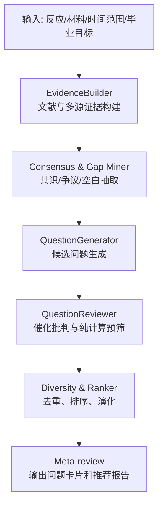
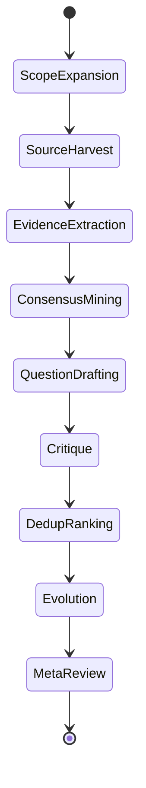

# 创新点和问题提出 Agent 设计

## 1. 定位

本 Agent 是整个 AI4Catalysis 自动科研系统中的前端复合 Agent。

它负责：

- 从文献和多源情报中抽取领域共识。
- 找出争议、矛盾、空白和产业/会议趋势。
- 将这些信号转化为结构化研究问题卡片。
- 对问题做初步批判、去重、排序和演化。
- 将高优先级问题交给后续 Agent 判断纯计算可验证性和计算规划。

它不负责：

- 最终确认题目一定新颖。
- 最终判定毕业成果档位。
- 生成 DFT 输入文件。
- 执行计算。
- 写最终论文正文。

## 2. 总体流程



工程上第一版实现为三个组件：

1. `EvidenceBuilder`
2. `QuestionGenerator`
3. `QuestionReviewer`

图中的其他节点先作为组件内部步骤，不单独拆 Agent。

## 3. 三个核心组件

### 3.1 EvidenceBuilder

职责：

- 根据用户输入扩展检索词。
- 导入本地 PDF/Markdown 文献和在线元数据。
- 构建文献矩阵。
- 抽取共识、争议、开放问题、方法和关键数据。
- 为所有候选论断绑定证据来源。

输入：

- 反应名称
- 催化材料族
- 时间范围
- 本地文献路径
- 在线数据源配置

输出：

- `source_records.jsonl`
- `literature_matrix.csv`
- `evidence_table.csv`
- `consensus_list.md`
- `controversy_list.md`
- `open_gap_list.md`

### 3.2 QuestionGenerator

职责：

- 基于共识和争议生成候选研究问题。
- 使用固定创新机会模式，避免问题过泛。
- 将问题转化为结构化卡片草稿。

内置创新机会模式：

| 模式 | 典型信号 | 适合题型 |
| --- | --- | --- |
| 共识未闭环 | 大家都说某因素重要，但缺少完整路径计算 | 机制重评估 |
| 文献矛盾 | 活性位点、速控步、描述符结论冲突 | 争议澄清 |
| 模型过简 | 只算理想表面，忽略缺陷/覆盖度/界面 | 模型修正 |
| 实验强计算弱 | 实验现象明确但机理解释不足 | 计算解释 |
| 产业热基础弱 | 专利/白皮书关注但基础机制不清 | 应用导向机制 |
| 数据可得未整合 | 数据库有相关数据但缺少系统建模 | AI4Catalysis 方法 |
| 标度关系异常 | 偏离常见吸附能标度关系 | 描述符发现 |
| 方法缺口 | 既有工作缺少 NEB/微观动力学/电子结构闭环 | workflow benchmark |

输出：

- 30-50 个候选问题草稿。
- 不少于 20 个初版问题卡片。

### 3.3 QuestionReviewer

职责：

- 检查每张问题卡片是否有文献证据。
- 检查是否只是泛泛选题。
- 初步判断是否可能由纯计算推进。
- 估计计算成本。
- 去重、合并、排序。
- 对高潜力问题进行演化改写。
- 输出推荐进入下一阶段的 3-5 个问题。

批判维度：

| 维度 | 问题 |
| --- | --- |
| 证据强度 | 是否至少有 2 条独立来源支持？ |
| 新颖性风险 | 近 5 年是否已有高度相似论文？ |
| 纯计算潜力 | 是否能用吸附能、能垒、电子结构、微观动力学回答核心问题？ |
| 催化合理性 | 是否有明确反应路径、活性位点和可构建模型？ |
| 论文故事线 | 是否能形成图表和主结论？ |
| 毕业价值 | 是否可能支撑 B 档机制论文或 A 档 Agent 案例？ |
| 成本可控性 | 是否能定义最小可发表计算集？ |

## 4. 状态机草案



MVP 可以先用顺序工作流实现。后续如果需要更强探索能力，再把 `QuestionDrafting`、`Critique`、`Evolution` 拆成 LangGraph 节点。

## 5. 评分公式

推荐总分：

```text
priority_score =
0.22 * novelty_score
+ 0.22 * computability_score
+ 0.18 * publishability_score
+ 0.14 * graduation_value_score
+ 0.14 * evidence_strength_score
+ 0.10 * cost_control_score
```

硬门槛：

- 少于 2 条证据：不得进入高优先级。
- 初筛为 C0：不得进入毕业主线。
- 近 5 年已有同体系同问题完整论文：不得进入高优先级。
- 无法构造明确计算模型：不得进入高优先级。
- 最小可发表结果集无法定义：不得进入计算规划。

分数解释：

| 总分 | 决策 |
| --- | --- |
| >= 85 | 强推荐，进入下一阶段 |
| 75-84 | 推荐，需补充证据或收窄问题 |
| 60-74 | 保留观察 |
| < 60 | 归档 |

## 6. 输出物

标准输出目录：

```text
outputs/
  literature/
    source_records.jsonl
    literature_matrix.csv
    evidence_table.csv
  insight/
    consensus_list.md
    controversy_list.md
    open_gap_list.md
    industry_signals.md
  question_cards/
    all_question_cards.json
    high_priority_cards.md
    rejected_cards.md
  review/
    ranking_table.csv
    meta_review.md
    evidence_gap_report.md
```

## 7. 与 Co-Scientist 的关系

借鉴：

- 生成多个候选假设，而不是只给一个答案。
- 对假设进行批判、排序和演化。
- 用元评审汇总最终推荐。
- 保留中间状态，支持审计和人工接管。

改造：

- 假设变成“催化研究问题卡片”。
- 评审标准加入纯计算可验证性。
- 排序标准加入毕业价值。
- 证据要求从“可参考文献”升级为“每条论断都要绑定证据”。
- 大规模 tournament 改为轻量去重排序。
