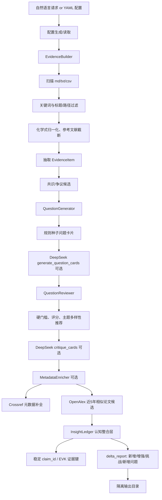

# 创新点和问题提出 Agent 当前工作总结

日期：2026-06-03

## 1. 当前定位

本 Agent 是“毕业导向 AI4Catalysis 自动科研 Agent”中的前端模块，负责：

- 从真实合成氨文献库中筛选与指定方向相关的论文正文和抽取表。
- 抽取证据句、共识候选、争议/空白候选。
- 生成研究问题卡片。
- 对问题卡片进行可计算性、发表潜力、毕业价值、成本和证据强度评分。
- 推荐高优先级问题，交给后续“纯计算可验证性判别 Agent”。

它不是完整自动科研系统；目前是一个可手动调用的 MVP。

## 2. 代码位置

项目目录：

```text
D:\SaXin\Science\自动科研Agent\创新点和问题提出Agent
```

核心文件：

```text
src/catalysis_question_agent/
  cli.py                 # 命令行入口
  workflow.py            # 总流程编排
  natural_request.py     # 自然语言请求 -> YAML/config patch -> 隔离运行
  llm_client.py          # DeepSeek API 客户端
  llm_tasks.py           # LLM 问题生成/批判任务
  evidence_builder.py    # 文献库扫描、筛选、证据抽取、共识/争议候选
  question_generator.py  # 规则种子问题卡片生成
  question_reviewer.py   # 评分、硬门槛、主题多样性推荐
  metadata_enricher.py   # Crossref/OpenAlex 元数据和相似论文候选
  insight_ledger.py      # 长期认识账本、稳定 claim_id 和 delta_report
  models.py              # Pydantic 数据模型
  config.py              # YAML 配置读取
```

真实文献库配置：

```text
06_config_real_ammonia_library.yaml
```

说明文档：

```text
07_真实合成氨文献库接入调试记录.md
08_DeepSeek_API接口配置说明.md
10_自动化升级方案与认知整合层.md
```

## 3. 当前 Pipeline



## 4. 已实现的输入模式

### 4.1 YAML 配置模式

命令：

```powershell
cd "D:\SaXin\Science\自动科研Agent\创新点和问题提出Agent"
python run_agent.py --config 06_config_real_ammonia_library.yaml --output outputs\real_ammonia_debug
```

适合工程调试。

### 4.2 自然语言问询模式

命令：

```powershell
python run_agent.py --config 06_config_real_ammonia_library.yaml --request "我想围绕 Ru-CeO2 中氧空位、Ru cluster active site 和 hydrogen poisoning 对 N2 活化与 NHx 氢化机制的影响，找 5 个适合纯计算推进的创新问题"
```

也支持请求文件：

```powershell
python run_agent.py --config 06_config_real_ammonia_library.yaml --request-file requests\my_request.md
```

自然语言模式由 DeepSeek 将请求转换为本次运行的 config patch。

## 5. 问询隔离机制

自然语言模式默认输出到：

```text
outputs\natural_requests\nl_时间戳_hash_slug\
```

每次问询单独保存：

```text
request\user_request.md
request\config_patch.json
request\generated_config.yaml
literature\evidence_table.csv
insight\consensus_list.md
question_cards\high_priority_cards.md
question_cards\all_question_cards.json
review\meta_review.md
metadata\enriched_metadata.csv
metadata\similar_works.csv
insight\insight_ledger_snapshot.json
insight\insight_delta.json
insight\insight_delta_report.md
llm\llm_call_log.json
```

`generated_config.yaml` 会脱敏 `llm.api_key`，避免把 key 复制到每个 run 目录。

## 6. DeepSeek 使用位置

DeepSeek API 配置在：

```text
06_config_real_ammonia_library.yaml
```

配置块：

```yaml
llm:
  enabled: true
  provider: "deepseek"
  api_key: ""
  api_key_env: "DEEPSEEK_API_KEY"
  base_url: "https://api.deepseek.com"
  model: "deepseek-v4-pro"
```

建议用环境变量保存 key：

```powershell
$env:DEEPSEEK_API_KEY="你的 key"
```

DeepSeek 当前参与三类任务：

1. 自然语言请求转 config patch。
2. 基于证据/共识/规则种子卡片生成更自然的问题卡片。
3. 批判高分卡片、改写标题、补充下游检查项。

## 7. 理想输入

自然语言输入最好是一个窄方向，例如：

```text
我想聚焦 Ru-CeO2 氨合成体系，重点关注 oxygen vacancy、Ce3+/Ce4+、Ru cluster active site 和 hydrogen poisoning，寻找可以用 DFT/NEB/电子结构分析纯计算推进的机制创新问题。
```

不建议太宽：

```text
帮我找合成氨催化剂创新点
```

因为太宽会导致问题卡片泛化。

## 8. 理想输出

最重要文件：

```text
question_cards\high_priority_cards.md
```

里面包含推荐问题、证据数量、计算路径提示、最小可发表结果集和 LLM/规则评审意见。

机器可读文件：

```text
question_cards\all_question_cards.json
```

后续 Agent 应读取这个文件。

新颖性辅助文件：

```text
metadata\similar_works.csv
```

它是近 5 年相似论文候选池，不是最终新颖性判定。

认知整合文件：

```text
insight\insight_delta_report.md
insight\insight_delta.json
insight\insight_ledger_snapshot.json
```

真实库配置还会维护一个长期账本：

```text
outputs\insight_ledger\real_ammonia_ru_ceo2_debug_ledger.json
```

该账本把本轮 `consensus`、`controversy` 和 `question_cards` 转为长期认识条目，每条有稳定 `claim_id`、支持/反对证据、争议状态、新颖性含义、可计算性含义和更新时间。每次运行会生成 delta report，区分 `new_claim`、`strengthened`、`challenged`、`new_question` 和 `unchanged`。

## 9. 当前真实库调试情况

真实文献库：

```text
D:\SaXin\Science\合成氨催化剂入库文献
```

已接入：

- Markdown 论文正文。
- extracted catalyst CSV 表。
- Crossref 元数据补全。
- OpenAlex 相似论文候选。

已有一次最终联网调试输出：

```text
outputs\real_ammonia_with_metadata_final
```

当时结果：

- 论文正文 source：14
- 高置信元数据：13
- 相似论文候选：40
- 推荐问题：5

推荐方向包括：

- Ru cluster active site
- electronic structure
- oxygen vacancy
- hydrogen poisoning
- rate-determining step

## 10. 当前限制

当前仍是 MVP：

- 证据抽取主要是关键词和句子规则，不是完整语义 claim extraction。
- 相似论文只是候选池，还没有严谨 rerank。
- DOI/元数据匹配有低置信标记，但仍需人工核验。
- InsightLedger 已能积累认识，但仍依赖当前规则/LLM 生成的候选命题，还不是严格的语义 claim extraction。
- 还没有接入“纯计算可验证性判别 Agent”。
- 没有前端，全部通过 CLI 使用。
- LLM 输出不能直接作为论文结论，只能作为候选问题和评审建议。

## 11. 下一步建议

最合理的下一步：

1. 完成信源注册表和 OpenAlex/Crossref/Semantic Scholar 增量搜集层。
2. 用 InsightLedger 的 `insight_delta_report.md` 做周报，只推送新增、增强、挑战和新增问题。
3. 对 `metadata/similar_works.csv` 做 rerank，形成真正的新颖性风险报告。
4. 搭建下游“纯计算可验证性判别 Agent”，读取 `all_question_cards.json` 和 `insight_delta.json`，输出 C0/C1/C2/C3。
5. 用自然语言模式多跑窄问题，对 `high_priority_cards.md` 人工挑选 1-3 张进入计算规划。
